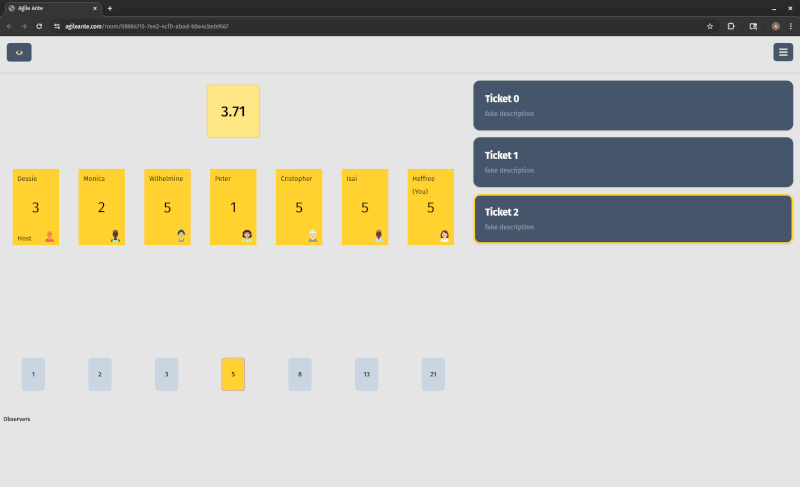

<!--
title: Project: Planning Poker (Post-mortem)
desc: A recap of a project I worked on for 7 months
date: 2025-10-06
-->
# Agile Ante
It's crazy that I've been working on this for 7 months — I counted and it was 43 days of those 7 months, but still. You can find the repo here: [agile-ante](https://github.com/heffree/agile-ante)

It's also not done. It's functional, but I had more planned for it. I'm just not having fun with it and I want to move on to something that aligns more with my interests.

## What is Agile Ante?
Agile Ante is my incarnation of planning poker. Planning poker is a way of gamifying task effort estimation.

My team had been moving from planning poker site to planning poker site, mostly because all of them introduced some sort of paywall to have more than 5 tickets a day. It was generally a meme around the domain that we should make our own.

One week, we ended up having a hackathon. Our goal, we decided, was to teach our BA some coding and so we used planning poker as the goal. We got almost nowhere, but we had fun and the BA learned a little more about what we do.

Fast forward a couple months and I decide I want to actually do it. I'll make the thing. By this point we had actually found [Kollabe](https://kollabe.com/) which is pretty fantastic and meets all of our needs. I thought "I'll create something that makes sure Kollabe stays fantastic", as a threat I guess?

So that's what I've been working on. My goal was to make it incredibly easy to distribute and spin up, but I didn't really make it to that point. I don't even have it dockerized.

## What it do?
Agile Ante lets you create a room, with you as the host, by visiting any URL in the domain. If the room already exists, you instead join the room.

As host you can: add tickets, select a ticket to vote on, and flip votes.

As a player you can: vote or observe.

There's also little avatars provided through [dicebear](https://www.dicebear.com/).

## The Stack
As I mentioned in [Project: Personal Site + Blog](./project-personal-site), my goto stack consists of:
- Cloudflare Domain (DNS only)
- Linode pod
- Nginx proxy
- Rust webserver with axum
- React client (embedded in the webserver)
- Sqlite DB

I really like that the client is embedded in the webserver executable, but the all-in-one kind of falls apart once you need persistence. I've jokingly thought about recompiling the executable every time state changes, but... yeah, that's not reasonable. Maybe I'll do that as a toy project someday.

## I quit
It's completely functional and if I really wanted to I could probably get it across the finish line of "easily self-hostable", whatever that means in practice other than a docker image. I've hosted it myself, but will be taking that down.

But there's a bit more I wanted to do before even the packaging step and at this point it feels fruitless. There's a great product that exists and I don't really need to create a free alternative to compete, especially one where I can't realistically host the shared infrastructure and I instead expect it to be self-hosted. I looked into some P2P stuff, but it seemed messy and still costly.

Here's my remaining todo list:
- [ ] URL Prefix Memory for tickets (use global state)
- [ ] Comma separated list with a url prefix for quick ticket making
- [ ] Graph showing votes
- [ ] Make tabindexes perfect
- [ ] Dark/Light
- [ ] Clean up unwraps
- [ ] Clean up React with proper hooks
- [ ] Make it hostable (docs, conveniences)
- [ ] Stop observers flipping lol
- [ ] General polish

## Simulation Testing
What I'm most proud of from this project is the simulation testing. I've played around with [TigerBeetle's Simulation](https://sim.tigerbeetle.com/) and have wanted to do setup data simulation at my job to mimic a live environment. This was a nice opportunity to do some of that with my auto clients. It made development a lot more enjoyable and was a great way to demo to people. Click below to see them in action!

## On to the next thing
Luckily I know what I want to work on next. I think it really aligns with not only the type of development I'm interested in, but also my favorite kind of software, and the type of "product" I want to be making. Can't wait! I'm sure it'll take years, but I'll do a little writeup on it next.
