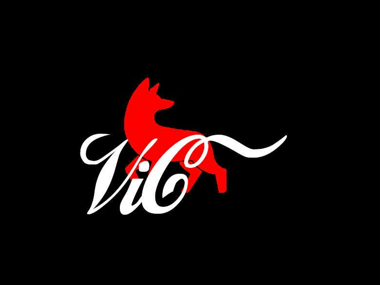

# More About Me
I guess this will be my first **real** blog post. I'm told I'm not actually the greatest writer who ever lived, so I'm going to cheat with my first entry and make it auto-biographical. Not too biographical, though... more self-referential? Just to say I'm not going to bother to write out my life story — I already did that in a draft.

## ME
I'm a fairly transparent person. I do my best to be honest. Life is **a lot** easier that way.

I worry a lot. I guess you could spin that as I like to think things through, but it's definitely a balancing act of not spiraling. For example, as many people do, I have fake — or "preparatory" — conversations with myself. These usually end with me telling the "other person" that I have actually already thought about all of this, even this part where I'm telling them I thought about it and even that part, and so on, and so on. I'm working on it; it's going well.

Probably related to the worrying, I try my best to be considerate. I definitely don't want to be the source of someone's discomfort. I'd really prefer to be the source of their peace. Though, this is also something I'm trying to reign in. I have a list of sayings that have meaning for me and third on that list is "Not everyone has to like you."

## Hobbies
It feels weird to describe the things I'm interested in as hobbies. I like learning. I want to be good at a lot of things. I'm currently bad at almost all of those things. I guess those are my hobbies.

Anyway, I want to know more about art, and be good at digital art — writing too. Ideally, I want to fuse digital art with programming. I've had drawing tablets and did some drawing as a kid, but I definitely was not, and am not, naturally talented at it and didn't really have the patience for things that didn't come easy. My wife is a great artist, though, so eventually I'll be able to take advantage of her taste.

I want to learn languages — Japanese, Korean, Spanish, and Arabic are on my insanely optimistic list. I've spent 2 years off-and-on studying Japanese. I worked through a list of 2200 basic Kanji, I have the entirety of a Rocket Languages course to get through, and I taught my wife to say "Tagetto wa doko desu ka" for if she ever needed to find a Target in Japan, of which none exist. Additionally, I learned some Spanish in middle school and high school, mostly getting C's. My college roommate was Palestinian... I used to know how to answer the phone and can no longer remember. Lastly, I just started listening to some more K-pop after seeing KPop Demon Hunters. Progress on all fronts!

Last of my learning crusade, programming. I love reading about programming. I love learning new programming languages, concepts, and technology. I love making things! It is my main craft and I'm lucky that it also gets to be my job — heck, I'm lucky to have a passion at all. Many people's passions are not necessarily financially viable as immediately as mine has been. I'm sorry we live in a world where a discussion regarding what we're most passionate about sharing leads to a weighing of if it can sustain us.

I also play video games. Overwatch mostly right now. Used to play League of Legends. I also enjoy coop games, single-player RPGs, etc. I watch TV, anime, and YouTube. I practice typing, switched to Colemak last year. I listen to all kinds of music. Eat good food, cook worse food. Play DnD. Love biking and swimming. And I'm not opposed to most other things!

## Career
Last section! Wooooooooo, first blog!

I've had two professional software engineering jobs in my life up to this point.

The first job I worked on two separate stacks that powered two separate internal intranets that served various web apps. The first was a WIMP stack (Windows Server, IIS, MySQL, PHP) and the second was a WIMN stack (..., Microsoft SQL Server, Node). At this job I learned a lot of **how** and **what**, very little **why**. I wasn't doing great financially which made it very hard to pursue additional learning and be excited about programming while working nights at Taco Bell.

I did get to do some fun stuff, though, and I learned a lot about databases. Our first intranet was called VIC (Viking Internal Communication or something like that) and so we named the second VIC-N, for VIC-Node, which we then ended up calling Vixen. I made this fun logo! Which eventually got removed because it confused people... oh, we were a Coca-Cola distributor, by the way.

The second job (current job) came with a relatively ridiculous pay bump and I found a mentor that taught me to learn the **how** and **what** all on my own, which I now had plenty of time for. My time at this job really reignited all of my passion for learning. More recently, I've even had a mentee/coworker who has taught me to really introspect on the **why**. I get to work with so many different technologies and a lot of great people. I'm incredibly grateful for all of the experiences and opportunities pursuing this job has provided me.
