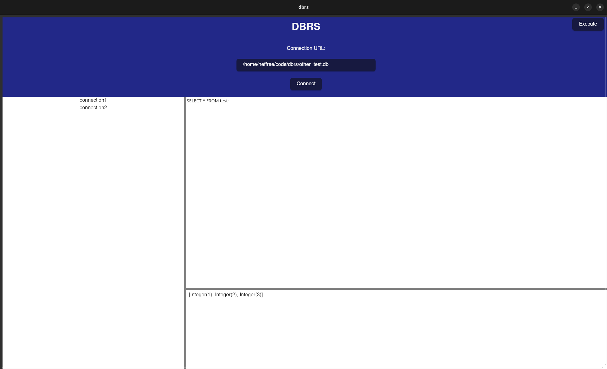

<!--
title: Project: DB Client (Post-mortem)
desc: I thought I could do it, but unfortunately, no
date: 2025-11-28
-->
# Done with dbrs
I'm moving on from my latest main project. I was going to make a DB Client in preparation for the retirement of Azure Data Studio.
Unfortunately, I don't think I'll be continuing with it. It's a shame because I really liked the name — instead of redeeming the name De Beers it will continue
to live on in infamy.

[tiny baby repo](https://github.com/heffree/dbrs)

## What it was
Yeah, just a client for connecting to databases. I got it working with sqlite databases. I originally started with a Dioxus prototype, 
but really didn't enjoy Dioxus so swapped over to Tauri. I really like Tauri, so I hope to use it again in the future.

I think I didn't like Dioxus because I'm really not used to the client/server interweaving. 
I didn't really understand managing state with it and I'm just much more comfortable with the server/client *separation*.

Tauri is very similar to what I'm doing with [beebfam](./project-beebfam-1.html) where I bundle the static site into the executable, so it was nice and familiar.
I ended up using a React frontend and 2 routes on the backend: `connect-to-db` and `execute-sql`.

## Why I'm stopping
I thought it would be something I really enjoyed working on. I had a goal of supporting all the DBs I use at work (SQL Server, Cosmos, Postgres, Mongo)
and for it to support Entra auth.
It felt like everywhere I looked none of the clients available to me supported Entra, but apparently I was off on that front. DBeaver seems to,
still have to get it setup,
but my coworker has informed me they're happily connecting through Entra. I also really didn't want to rely on VSCode for my DB access, which seems to be where
Microsoft is pushing us.

I didn't get very far. I got sqlite connections working and then started working on the frontend. I setup sections for listing connections, input, and output.
Basically looked like kindergarten ADS. 

What really killed me was I wanted to be able to use Vim motions in the input, but all I could really find was 
[Vim.js](https://wang-lu.com/vim.js/streamlinejs/vim.html) and my main way of exiting Insert mode (C-c) doesn't work,
so I'd probably want to look into making my own. And that's just already too big of a hurdle for something I was hoping to share,
it's not something I can reasonably make.

I'm willing to put in the time, but it's important to me that I see bespoke long-term value in it for myself, and ideally, others.
It's also important for me to use the correct tools.
In VSCode, ADS, and DBeaver there are ways to enable a Vim mode, mostly through plugins. This made me realize something I had a pretty good inkling of —
DB Clients are text editors at their core. This is something I probably could've come to terms with much sooner given neovim and VSCode can both be turned into
perfectly acceptable DB Clients through plugins.

For some reason I thought this was also somewhat niche. A DB Client didn't seem like something a ton of people had interest in creating, but I did,
at least in the interacting with the DB part. Something I'm not really interested in is making an editor. Maybe I should make an ORM, haha...

## What next
I'm super happy I got some exposure to Tauri. Like I said, I hope I get to use it again soon. I really want to make something useful and I want it to be somewhat technical.
Everything I can think of seems either overly-ambitious or completely useless.
I'm leaning towards a KVM a la [Input Leap](https://github.com/input-leap/input-leap).

Yeah, I think that's a good next project. It's something I could use personally, it would teach me a lot about different OSes, and I'm pretty sure it doesn't
involve making a fullblown editor.

I also realize I could've kept my DB Client simpler and added things like a plugin system over time, but nah, it just feels weird. I got what I wanted out of it.

A KVM definitely isn't going to be simple, Input Leap's issues backlog is pretty large and a lot of the problems insurmountable. Hopefully it can just be a nice
anchor while I work on whatever I want in general.

I'll also probably start playing around with some graphics and compiler stuff.
I'm also hoping to get into some soldering, would be fun to also incorporate some embedded programming.

So that's that, some small toy projects and a KVM is likely my future at the moment. I could also look at transitioning to making my own DB Client neovim plugin... 

I don't know — we'll see how it goes! I'll report back when I decide and likely wait until I have some meaningful progress.
